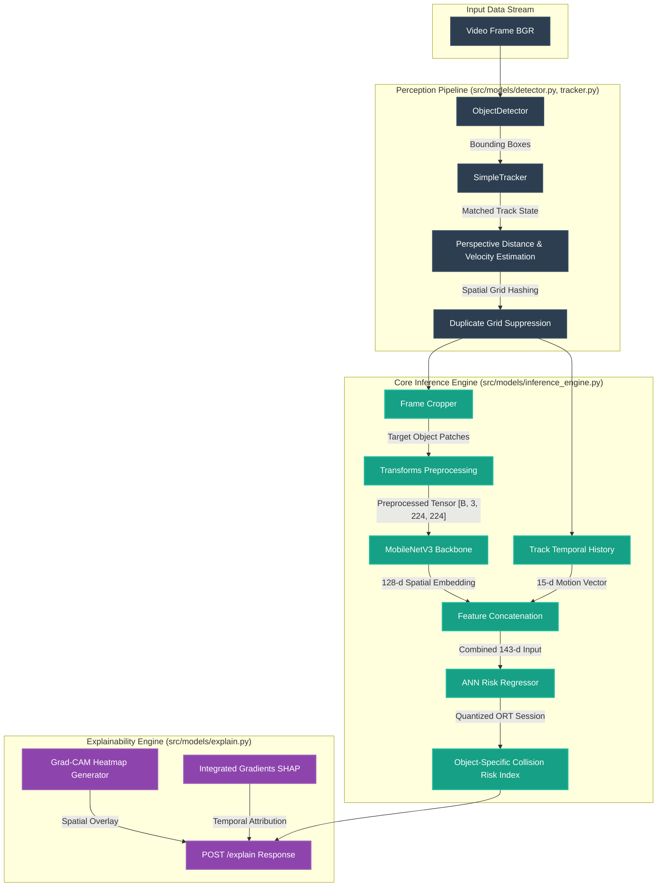

# ChronoSpatial Engine

[](https://github.com/Debddj/ChronoSpatial-Engine/actions/workflows/ci-cd.yml)
[](https://fastapi.tiangolo.com)
[](https://pytorch.org)
[](https://onnxruntime.ai)

A production-grade, real-time perception, tracking, and explainable collision-risk assessment system. ChronoSpatial Engine processes high-frequency video streams and telemetry to track objects, estimate their motion kinematics (velocity and distance) across frames, evaluate spatial-temporal risk via a quantized CNN-ANN network, and provide auditable explanations.

---

## 🌌 System Architecture



---

## 🛠️ Key Capabilities & Insights

### 1. Multi-Mode Object Detection & Tracking
- **Multi-Tier Fallback Object Detector** (`src/models/detector.py`):
  - **YOLOv8** (`ultralytics`): Primary high-accuracy detector.
  - **SSDLite320** (`torchvision`): Secondary CPU-optimized CNN detector.
  - **OpenCV Contours**: Tertiary fallback contour extractor. Operates with zero network/weights dependencies.
- **State Estimation Tracker** (`src/models/tracker.py`):
  - Implements **Intersection-over-Union (IoU)** greedy track matching.
  - Estimates **longitudinal/lateral velocity vectors** and **relative distance** dynamically from consecutive frames.
  - Maps track centers to a configurable **spatial grid** (size defined by `grid_size`) and performs spatial duplicate suppression to optimize throughput.

### 2. Physics-Based Model Training Loop
- **Synthetic Simulator & Trajectory Generator** (`scripts/train.py`):
  - Simulates obstacle trajectories at 10 Hz with random speeds and starting distances.
  - Labels training data using Time-To-Collision (TTC) physics:
    $$TTC = \frac{\text{distance}}{\text{relative speed}}$$
    $$\text{risk} = e^{-0.5 \cdot TTC}$$
  - Renders perspective-correct obstacles onto $224 \times 224$ training frames corresponding to their simulated distance and lateral offset.
- **PTQ Quantization**:
  - Exports PyTorch checkpoints (`models/chronospatial_unified.pt`) to static INT8 QDQ ONNX production models.
  - Reduces production model size by **67.39%** (from 4.46 MB to 1.45 MB) while keeping MAE variation negligible.

### 3. Auditable Explanations (Grad-CAM & Path SHAP)
- **Grad-CAM**: Computes backpropagated activation maps on the final convolution block of MobileNetV3 to overlay a visual attention heatmap on the cropped frame, demonstrating *where* the model is looking to evaluate collision risk.
- **Integrated Gradients**: Path-integrates gradients along a linear path from a zero-motion baseline to the target input, providing SHAP-style attribution scores showing exactly *which* velocities and distances contributed to the risk score.

---

## 📂 Repository Layout

- `src/models/`:
  - `detector.py`: Multi-tier fallback object detector.
  - `tracker.py`: IoU state-tracking and grid-occupancy compiler.
  - `inference_engine.py`: Orchestrates object-level ONNX Runtime session execution.
  - `explain.py`: Grad-CAM and Integrated Gradients (Path SHAP) explainability algorithms.
  - `unified_model.py`: PyTorch unified model combining MobilenetV3 CNN + ANN risk regressor.
- `src/serving/`: FastAPI application (`app.py`) and API routers (`router.py`).
- `scripts/`: Training (`train.py`), ONNX exporting (`export_onnx.py`), and PTQ quantization (`quantize_onnx.py`).
- `config/`: System YAML configurations for spatial parameters and thresholds.
- `tests/`: Automated unit and API integration tests.

---

## ⚡ API Endpoints

### 1. WebSocket Telemetry Stream
- **Path**: `/ws/telemetry`
- **Protocol**: WS / Binary
- **Accepts**: Binary JPEG/PNG frame bytes.
- **Returns**: Real-time object tracking and risk assessment:
  ```json
  {
    "risk_score": 0.85,
    "is_anomaly": true,
    "inference_time_ms": 12.4,
    "tracked_objects": [
      {
        "track_id": 1,
        "bbox": [100.0, 110.0, 200.0, 210.0],
        "grid_cell": [7, 8],
        "velocity": [0.05, -1.2],
        "distance": 8.35,
        "risk_score": 0.85
      }
    ]
  }
  ```

### 2. HTTP Explain Endpoint
- **Path**: `/explain`
- **Method**: POST
- **Accepts**: Multipart Form
  - `file`: BGR/RGB frame (binary JPEG/PNG)
  - `bbox`: Optional string `"ymin,xmin,ymax,xmax"` to crop a specific target object.
  - `temporal_features`: Optional string containing 15 comma-separated floats (motion history).
- **Returns**: Spatial heatmap overlay and temporal SHAP attributions:
  ```json
  {
    "risk_score": 0.85,
    "spatial_heatmap_b64": "/9j/4AAQSkZJRg...",
    "temporal_attributions": {
      "velocity_history": [
        { "step_t": -4, "vx_attribution": -0.002, "vy_attribution": 0.05 },
        ...
      ],
      "distance_history": [
        { "step_t": -4, "attribution": 0.12 },
        ...
      ]
    }
  }
  ```

---

## 🚀 Getting Started

### Installation
Ensure you are using Python 3.10+ (Python 3.12/3.14 recommended). Set up your virtual environment and install dependencies:
```bash
python -m venv .venv
.venv/Scripts/activate  # On Windows
.venv/bin/activate      # On Linux
pip install -r requirements.txt
```

### Running Model Training & Quantization
To generate the physics-based synthetic dataset, train the PyTorch model, and regenerate the quantized ONNX production model:
```bash
python scripts/train.py
```

### Starting the Server
```bash
uvicorn src.serving.app:app --host 0.0.0.0 --port 8000 --reload
```

### Running the Test Suite
```bash
python -m pytest
```
